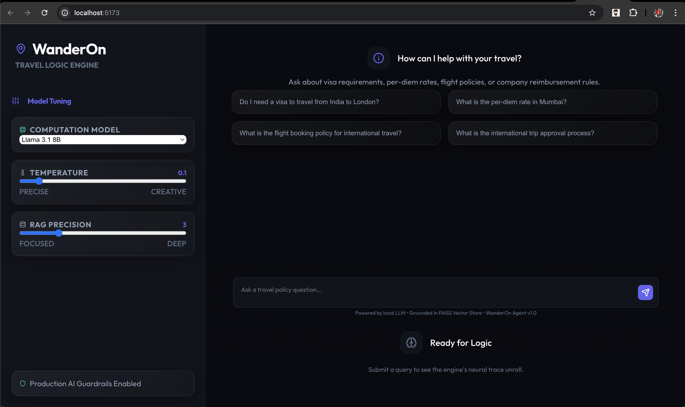

# WanderOn Agent

An **intelligent AI system** that decides *how* to answer travel-policy queries — not just *what* to answer. Routes queries to the optimal execution path, preventing unnecessary LLM calls and hallucinations.




## Architecture

```
User Query
    │
    ▼
[Input Guardrails] → PII check, injection detection, length validation
    │
    ▼
[Hybrid Router] → Rules (instant) + LLM classifier (fallback)
    │
    ├── SMALL_TALK       → Canned response (no LLM)
    ├── FACT_FROM_DOCS   → RAG pipeline → Groundedness check
    ├── STRUCTURED_DATA  → Schema-validated tool execution
    └── OUT_OF_SCOPE     → Polite refusal
    │
    ▼
[Structured Logging] → JSONL logs, feedback collection
```

## Tech Stack

| Layer      | Technology              |
| ---------- | ----------------------- |
| API        | FastAPI                 |
| LLM        | Ollama (`llama3.1:8b`)  |
| LLM SDK    | `langchain-ollama`      |
| Validation | Pydantic v2             |
| RAG        | FAISS (IndexFlatL2)     |
| Embeddings | sentence-transformers   |
| Logging    | Loguru (JSONL)          |
| Testing    | pytest                  |

## Quick Start

### Prerequisites
- Python 3.10+
- [Ollama](https://ollama.com) installed and running

### Backend Setup

```bash
# 1. Install Ollama model
ollama pull llama3.1:8b

cd ai-travel-router

# 2. Install Python dependencies
pip install -r requirements.txt

# 3. Build the FAISS index (one-time)
python -c "from src.rag.pipeline import get_retriever; get_retriever().build_index()"

# 4. Run the server
uvicorn src.main:app --reload
```

### Frontend Setup

```bash
cd frontend
npm install
npm run dev
```

### API Usage

```bash
# Health check
curl http://localhost:8000/health

# Query (small talk)
curl -X POST http://localhost:8000/query \
  -H "Content-Type: application/json" \
  -d '{"query": "hello"}'

# Query (RAG - policy lookup)
curl -X POST http://localhost:8000/query \
  -H "Content-Type: application/json" \
  -d '{"query": "What is the per diem rate for Bangalore?"}'

# Query (structured data)
curl -X POST http://localhost:8000/query \
  -H "Content-Type: application/json" \
  -d '{"query": "Do I need a visa to travel from India to UK?"}'

# Feedback
curl -X POST http://localhost:8000/feedback \
  -H "Content-Type: application/json" \
  -d '{"request_id": "<uuid>", "feedback": "positive"}'

# Rebuild index
curl -X POST http://localhost:8000/index/build
```

## Testing

```bash
pytest -v
```

## Project Structure

```
ai-travel-router/
├── src/
│   ├── main.py              # FastAPI app & orchestration
│   ├── schemas.py           # All Pydantic models
│   ├── router.py            # Hybrid query router
│   ├── llm/
│   │   ├── local_llm.py      # Ollama wrapper
│   │   └── prompts.py        # All LLM prompt templates
│   ├── rag/
│   │   ├── embeddings.py     # Sentence-transformers wrapper
│   │   ├── load_docs.py      # Document chunker & loader
│   │   ├── retriever.py      # FAISS retriever
│   │   ├── groundedness.py   # Groundedness verifier
│   │   └── pipeline.py       # Full RAG pipeline
│   ├── tools/
│   │   ├── travel_tools.py   # 4 allow-listed tool functions
│   │   └── executor.py       # LLM-based tool param extraction
│   ├── guardrails/
│   │   └── input_guards.py   # PII, injection, confidence guards
│   └── observability/
│       └── logging.py        # Structured JSONL logging
├── frontend/                # React modern UI
│   ├── src/
│   │   ├── App.jsx          # Main chat interface
│   │   ├── components/      # UI components
│   │   │   ├── ThinkingTrace.jsx # Live pipeline visualization
│   │   │   └── ConfigPanel.jsx   # LLM parameter controls
│   │   └── index.css        # Global styles & design system
│   └── package.json         # Frontend dependencies
├── data/
│   ├── policies/             # Travel policy documents (.md, .txt)
│   └── faiss_index/          # Persisted FAISS index
├── tests/                    # pytest test suite
├── logs/                     # Runtime logs (JSONL)
├── .env                      # Configuration
├── requirements.txt
└── README.md
```

## Key Features

- **Hybrid Routing**: 60-70% of queries handled by instant rules (<1ms), LLM only for ambiguous ones
- **Groundedness Check**: RAG answers verified against retrieved context — rejects hallucinations
- **Schema-Validated Tools**: Pydantic validation on all tool inputs, allow-list enforcement
- **Non-Prompt Guardrails**: PII detection, injection blocking, confidence thresholds — all programmatic
- **Full Observability**: Every decision logged with confidence, latency, route, and guardrail status
- **Runs Fully Offline**: Local Ollama LLM, no 3rd-party API calls

## Frontend Details

The **WanderOn** interface is a premium React-based dashboard designed for deep transparency into the AI's reasoning process.

- **Thinking Trace**: A live, step-by-step visualization of the agent's internal pipeline (Guardrails -> Routing -> Execution).
- **Config Panel**: Real-time adjustment of LLM parameters (Model, Temperature, Top-K) to tune behavior on the fly.
- **Modern Dark UI**: A high-fidelity, "glassmorphic" design built for productivity and visual excellence.
- **Streaming-like Feedback**: Visual status indicators for RAG groundedness, tool execution success, and token consumption.
