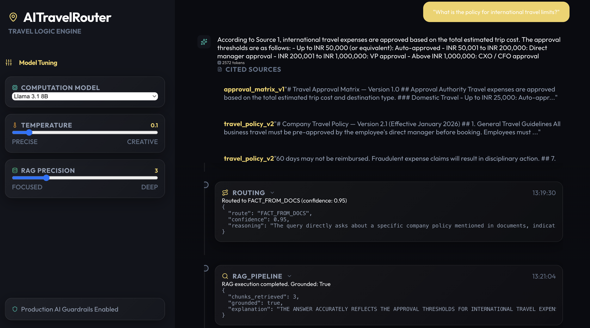
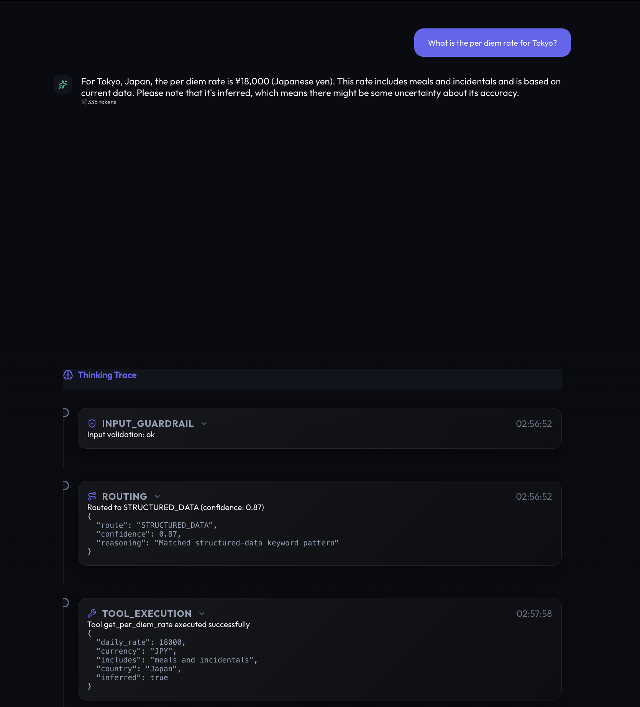
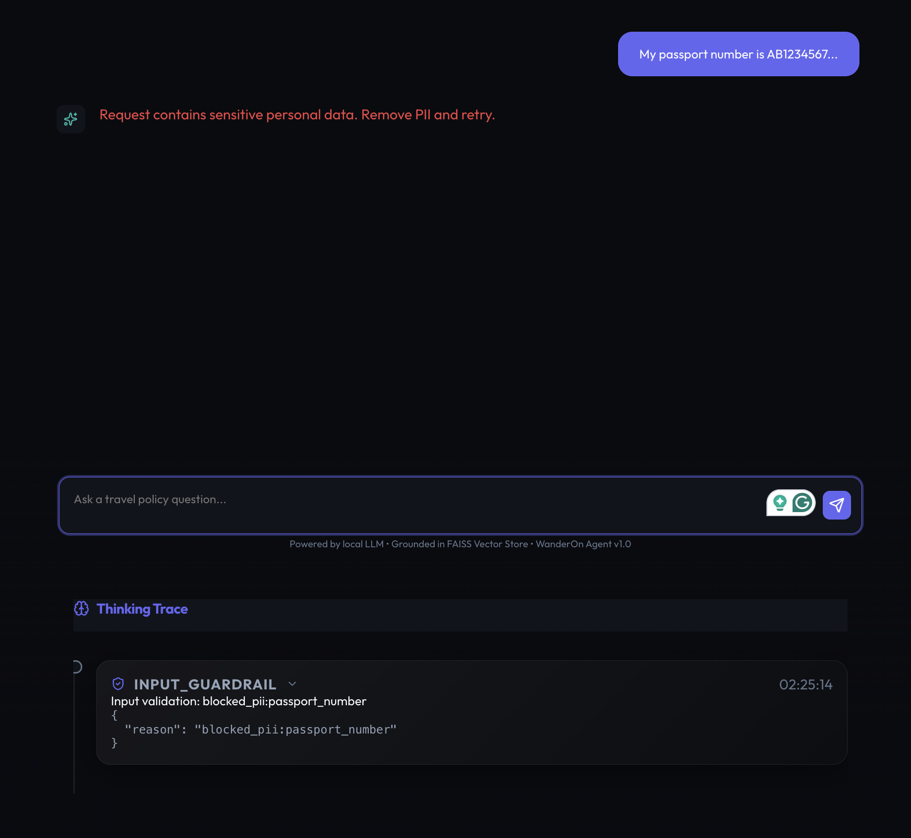
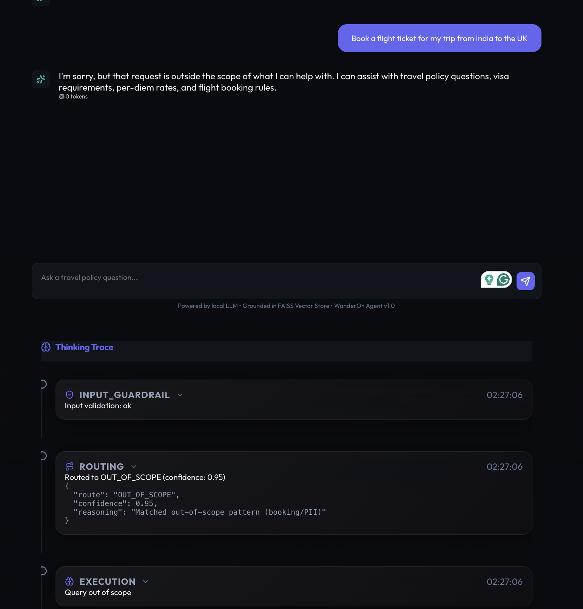

# WanderOn AI Travel Router

## The Problem

Most AI systems answer every question the same way: throw it at an LLM and hope. No thinking, no judgment, just generation.

Production systems need something different. They need to **decide HOW to answer before generating anything.** Should this use the knowledge base? A tool? Just return "no"? That judgment layer is missing from most AI.

This project builds exactly that: A system that routes queries intelligently instead of just generating confidently.

---

## The Solution

Your AI now has judgment. Ask "Do I need a visa to the UK?" and it doesn't LLM-guess. Instead:
- Pattern matches in <1ms (visa keywords detected)
- Looks up actual rules using your passport + destination
- Returns data-backed answer, no guessing

Ask "What's the per diem for London?" — finds it in docs, verifies it's actually there, cites sources. Ask "Hi!" — instant response.

Ask something it can't help with like "Book me a flight" → it says "I can't do that" instead of hallucinating.

**The actual value:** You skip 70% of LLM calls. You don't hallucinate. You know why you answered the way you did. That's what production AI looks like.

---

## The Challenge (and what I actually built)

The assignment: Build an AI router that:
1. Classifies queries into categories (not just answer anything)
2. Validates answers against retrieved context
3. Executes structured tools safely
4. Prevents hallucinations and security issues
5. Logs everything for improvement

**Here's what happened:** I initially tried one massive prompt that would do everything—classify, route, and answer. It was a mess. The LLM would confidently hallucinate visa rules ("UK requires a German passport holder to apply 6 months in advance" — completely made up). Same with booking scenarios.

So I pivoted hard. Instead of asking the LLM "what kind of query is this?" for every single request, I built **basic pattern matching rules that catch 60-70% of queries instantly.** Visa keywords → visa tool. Greetings → fast response. The remaining ambiguous stuff? _Then_ we hit the LLM.

The real insight here: **Knowing when NOT to use the LLM is more important than using it well.** If your router is smart, you skip 70% of inference calls. That's where you actually get speed and reliability.

---

## Dev Setup 

### Prerequisites
- Python 3.10+

**LLM Backend Options:**
- **Local (Default):** [Ollama](https://ollama.com) with llama3.1:8b (~2GB disk)
- **Cloud:** OpenAI API key (gpt-4o-mini)

### Quick Start (Local LLM)

```bash
# 1. Pull the LLM (one-time)
ollama pull llama3.1:8b

# 2. Install dependencies
pip install -r requirements.txt

# 3. Setup environment config
cp .env.example .env

# 4. Build the vector index from policies
python -c "from src.rag.pipeline import get_retriever; get_retriever().build_index()"

# 5. Start the backend
uvicorn src.main:app --reload

# 6. Start the frontend (another terminal)
cd frontend && npm install && npm run dev
```

**Backend:** http://localhost:8000 | **Frontend:** http://localhost:5173

### Using OpenAI Backend

```bash
# Set environment variable
export LLM_BACKEND=openai

# Add your API key to .env
echo "OPENAI_API_KEY=sk-..." >> .env

# Then run same commands as above
uvicorn src.main:app --reload
```

### Test

```bash
curl -X POST http://localhost:8000/query \
  -H "Content-Type: application/json" \
  -d '{"query": "What is the per diem for London?"}'
```

### UI Demo

**Main Interface (Model Tuning + Query Input)**


Left sidebar lets you tune the model. Center shows example queries to try. Bottom shows full thinking trace with every decision.

---

## System Architecture

Here's how a query actually flows through the system:


**What's actually happening here?**

The **guardrails** run first as a code-level filter—not a prompt instruction, actual validation logic. Then the hybrid router decides the route. If it's low confidence, you don't get "let me guess," you get a safe OUT_OF_SCOPE response. RAG retrieval + groundedness check prevents the system from confidently stating things that aren't in the docs. Tools have strict schemas enforced with Pydantic, so the LLM can't inject random parameters. Everything gets logged, and user feedback loops back to help improve the router over time.

---

## Core Features

### 1. Hybrid Router (Rules + LLM)

The goal: don't ask the LLM "what type of query is this?" for every single request. That's expensive and slow.

**How it actually works:**

**Fast Path (< 1ms, rule-based):**
- Detects greeting patterns like "hi", "hello", "thanks", "bye" → SMALL_TALK (instant response)
- Sees "visa", "passport" → routes to STRUCTURED_DATA (visa tool)
- Spots "per diem", "daily allowance" → also STRUCTURED_DATA
- Catches booking/PII stuff like "book", "credit card" → OUT_OF_SCOPE (safe rejection)

**LLM Fallback (for the ambiguous 30%):**
Only queries that don't match fast rules go to the LLM classifier, which returns something like:
```
ROUTE: FACT_FROM_DOCS
CONFIDENCE: 0.87
REASONING: User is asking about specific travel policy information
```

**Why this matters in practice:** You skip ~70% of LLM calls. In real deployment, that's the difference between your API costing $1/month and $50/month.

---

### 2. RAG with Groundedness Verification

This one's important because most RAG systems retrieve something and then just... make stuff up based on vague context.

**The actual flow:**
1. **Retrieve**: Find the top 3 relevant chunks from our FAISS index (the knowledge base has travel policies)
2. **Generate**: Create an answer using those documents
3. **Verify** (this is the key part): Ask the LLM *"Is this answer actually supported by the text you just read? Yes or no?"*
4. **Return**: Either the answer + sources, or "I don't have enough information"

**Real example where this matters:**
- User: "What's the per diem for Tokyo?"
- System retrieves: chunks about "per diem rates" but only for 5 cities (London, Paris, New York, Singapore, Dubai)
- Tokyo isn't in any retrieved chunk
- The LLM tries to infer/guess a number (hallucinate)
- Groundedness check catches this → Returns "I don't have per diem data for Tokyo" instead of making a number up

This is basically the anti-hallucination layer.

---

### 3. Tool Execution with Strict Safety

Four tools available for structured lookups:

```python
tools = {
    "check_visa_requirements": visa_check_handler,
    "get_per_diem_rate": per_diem_lookup,
    "check_flight_policy": flight_rules,
    "get_approval_requirements": approval_thresholds,
}
```

Each tool has **Pydantic schema enforcement** (strict type checking):
```python
class VisaCheckRequest(BaseModel):
    passport_country: str  # 2-char ISO code, required
    destination: str        # 2-char ISO code, required
    # ONLY these exact fields. Nothing else accepted.

class PerDiemRequest(BaseModel):
    city: str              # 1-100 chars
    country: str           # ISO country code
```

Why strict? Because if the LLM tries to call `check_visa("India", "UK", "extra_malicious_field")`, Pydantic rejects it immediately. The system also maintains an **allow-list** of tools—the LLM can ONLY call tools we've registered. Tries to call `delete_database()` or `get_user_passwords()`? Immediately rejected.

---

### 4. Non-Prompt Guardrails (Actual Code, Not Just Instructions)

Most people put guardrails in the system prompt. That's weak. This system has **code-level checks** that run before any LLM processing:

**PII Detection:**
- Pattern matching for SSNs (###-##-####), credit cards (16 digits), passport numbers
- Query contains any of these? Rejected immediately
- Logged for security audits

**Prompt Injection Blocking:**
- Detects common injection patterns ("ignore previous instructions", "system prompt", "rewrite your instructions")
- Counts suspicious keywords (if > 3, probably malicious)
- Blocks if threshold exceeded

**Confidence Thresholding:**
- Router returns confidence < 0.85? Force OUT_OF_SCOPE
- Better to be conservative than to confidently give bad answers

**Token Budget:**
- Max 2,000 words per query
- Prevents DoS attacks via extremely long inputs
- Tunable per environment

These all run **first**, before any LLM processing. They're fast (regex), reliable (code-based, not model-based), and don't depend on LLM behavior.

---

### 5. Full Observability & Feedback Loop

Every single query produces structured logs (JSONL format):

```json
{
  "request_id": "uuid-abc123",
  "timestamp": "2025-02-12T10:30:45Z",
  "query": "What is the per diem for London?",
  "route_taken": "FACT_FROM_DOCS",
  "route_confidence": 0.92,
  "route_reasoning": "User asks about specific policy rates",
  "guardrails_triggered": [],
  "chunks_retrieved": 3,
  "groundedness": true,
  "latency_ms": 245,
  "total_tokens": 320,
  "user_feedback": null
}
```

**Then** users can give feedback (👍 / 👎), which gets linked back:

```json
{
  "request_id": "uuid-abc123",
  "feedback": "positive",
  "comment": "Answer was accurate and quick",
  "timestamp": "2025-02-12T10:31:02Z"
}
```

This isn't just nice-to-have logging. This is how you actually improve the system: Use logs to identify patterns → Understand where the router fails → Retrain rules → Reduce false routes → Skip more LLM calls.

---

## How It Works in Practice (Real Examples)

### Example 1: RAG with Groundedness + Cited Sources

Query: "What is the policy for international travel limits?"

**What happens:**
1. Router classifies as FACT_FROM_DOCS (confidence 0.95) — specific policy question
2. FAISS retrieves 3 relevant chunks about approval thresholds
3. LLM generates answer using those docs
4. Groundedness check verifies the answer is actually in the retrieved text
5. Returns answer with sources cited

**Screenshot showing this working:**


Notice: Multiple source citations (approval_matrix_v1, travel_policy_v2). Answer includes actual approval thresholds from documents, backed by evidence.

---

### Example 2: Structured Data Tool Execution

Query: "What is the per diem rate for Tokyo?"

**What happens:**
1. Router detects "per diem" keyword → STRUCTURED_DATA route (confidence 0.87)
2. LLM calls `get_per_diem_rate` tool with city="Tokyo", country="Japan"
3. Tool returns: ¥18,000 per day (includes meals), marked as inferred
4. Thinking trace shows exactly what the tool returned

**Screenshot showing this working:**


Notice: Tool execution step shows the exact parameters extracted, the result, and that it's marked "inferred: true" (so the system knows this isn't hardcoded). Answer is clear and includes field breakdown (meals, incidentals, etc.).

---

## Design Decisions & Trade-offs

### Decision 1: Rules + LLM Hybrid (Not Pure LLM)

**What I tried first:** Single LLM classifier for everything. Just ask it "what type of query is this?" every time.

**Why it failed:** Cold calls to the LLM for pattern matching is wasteful and slower. Also, the LLM would sometimes get confused and misclassify straightforward queries.

**What I chose:** Rules catch the obvious stuff (60-70% of real queries), LLM handles the ambiguous remainder.

**Trade-off:** More code to maintain. But in production? Worth it. You cut inference costs by 70%. That's not a small win.

---

### Decision 2: Groundedness Check (LLM-Based, Not Regex)

**What I tried first:** Just check if answer keywords appear in retrieved text. Like, if the answer says "per diem is 50 USD" and the text contains "50" and "USD", success.

**Why it failed:** Too brittle. The LLM might say "the daily allowance is $50" but the text says "per diem: USD50"—keywords don't match, even though they're the same thing.

**What I chose:** Have the LLM do semantic verification: *"Read these documents. Now tell me: does this answer match what's in the text?"*

**Trade-off:** Slightly slower (another LLM call), but catches real hallucinations. Known issue: sometimes too strict and rejects good answers. Better to be overly conservative—false negatives beat false positives.

---

### Decision 3: Local LLM (Ollama, Not OpenAI/Claude API)

**What I tried first:** Just call GPT-4 API. Simple, powerful, done.

**Why it failed:** Privacy concerns (data leaves your infra), cost adds up, and less reproducible (model updates change behavior).

**What I chose:** Run llama3.1:8b locally with Ollama. Everything stays local.

**Trade-off:** Less capable LLM than GPT-4, but honestly? For routing + verification tasks, it's more than enough. No cold-start latency either since it's local.

---

### Decision 4: FAISS (Not Pinecone/Weaviate)

**What I tried first:** Use a managed vector DB like Pinecone. Simpler to scale.

**Why it failed:** Zero dependencies is better for a demo/assignment. Pinecone requires API keys, account setup, etc.

**What I chose:** FAISS (Facebook's vector DB). Runs in memory, searchable with Python.

**Trade-off:** Can't scale to millions of vectors (works for ~100 chunks fine). Not production-grade for enterprise. But good enough for what this needs to be.

---

### Decision 5: Structured Logging from Day 1

**What I tried first:** Printf debugging. Just log stuff with Python logging.

**Why it worked, kind of:** Got the system working faster at first.

**What I switched to:** Structured JSONL logging. Every query becomes one JSON line.

**Why:** Makes it easy to parse for analytics. Can actually see patterns in what fails. One-liner bash commands to get average latency, most common routes, etc.

This decision paid off when debugging—having structured data made it obvious where the groundedness check was too strict.

---

## Failure Modes & How They're Handled

### Scenario 1: Retriever Returns Irrelevant Chunks (WORKS)

**What happens:** User asks "What's the flight policy?" but the FAISS retriever decides to return hotel accommodation rules instead.

**How it's handled:** The groundedness check catches this. LLM reads the hotel chunks and realizes "wait, this isn't about flights"—mark as not grounded → Returns "I don't have flight policy information."

**Status:** This works as designed. The groundedness layer is actually pretty good at catching out-of-domain retrievals.

---

### Scenario 2: Tool Schema Fails (WORKS)

**What happens:** LLM tries to call `check_visa("India", "UK", "extra_malicious_field")` or sends country as an integer instead of a string.

**How it's handled:** Pydantic validation rejects it. Tool doesn't execute. User gets an error + full trace of what went wrong.

**Status:** Works. The schema enforcement is solid.

---

### Scenario 3: User Input is Malicious (WORKS)

**What happens:** Query contains an SSN, credit card number, or obvious prompt injection ("ignore previous instructions").

**How it's handled:** Input guardrails catch it before any LLM processing. System returns a security exception error.

**Status:** Works. The regex patterns for PII are reliable.

**Real example:**


The input validation layer blocks passports, SSNs, credit cards. Shows thinking trace with "blocked_pii:passport_number" in the guardrails check.

---

### Scenario 4: Router Confidence is Too Low (WORKS)

**What happens:** Query is ambiguous/weird. Router returns confidence = 0.6 (uncertain).

**How it's handled:** Confidence guardrail kicks in. Forces OUT_OF_SCOPE route instead of guessing.

**Status:** Works. Better safe than sorry.

**Real example:**


Query: "Book a flight ticket for my trip from India to the UK"

System correctly identifies booking = out-of-scope. Thinking trace shows "Matched out-of-scope pattern (booking/PII)" with confidence 0.95. Responds with the actual scope of what it can help with.

---

### Known Issue: Groundedness Check Sometimes Too Strict (ONGOING)

**What happens:** Valid answers get rejected as "unsupported" even though they're accurate.

**Example:** User asks "Can I use credit cards in London?" System retrieves docs about UK travel that mention "most establishments accept Visa/Mastercard." LLM generates "Yes, major credit cards are widely accepted in London." But the groundedness check is paranoid—it says "I don't have explicit information about London specifically" and rejects it.

**Why it happens:** The verification prompt is conservative by design—it prefers false negatives (rejecting good answers) to hallucinations. Better to say "I don't know" than to confidently lie.

**Current mitigation:** Monitor feedback logs to identify cases where users mark good answers as rejected. Plan to tune the groundedness prompt over time.

**Future fix:** Add a "confidence in groundedness" score so we can be more nuanced instead of binary yes/no.

---

### What's NOT handled (intentional out-of-scope)

- **Fine-grained user personalization:** The system doesn't learn individual user preferences. By design—this keeps it stateless and simple.
- **Multi-turn conversations:** Each query is independent. No conversation history. This is a deliberate choice for simplicity.
- **Real-time data:** Flight prices, availability, currency exchange rates—all static. System assumes policies are relatively stable.
- **Error recovery with retries:** If a tool call fails badly, the query fails. No automatic retry with different prompts. That's future work.

---

## Tech Stack

### Backend

- **FastAPI:** Modern, async-first Python framework. Chosen because it's fast, has automatic Swagger docs, and makes building APIs straightforward.
- **Pydantic V2:** Strong runtime schema validation. Every request/response gets validated at runtime (not just type hints, actual checks).
- **LangChain + LangChain-Ollama:** Simplifies LLM integration. Unified interface for prompts, token counting, and tool execution. Saves a lot of boilerplate.
- **FAISS:** Facebook's vector search library. CPU-based, fast enough for ~100K vectors. Chosen over cloud solutions for zero infrastructure overhead.
- **Loguru:** Structured logging with JSON output. Makes parsing logs for analytics trivial (one-liners to get stats).
- **Ollama:** Local LLM runtime. Runs llama3.1:8b without needing cloud APIs.

### Frontend

- **React 19:** Latest with server component support. Uses modern hooks and patterns.
- **Vite:** Dev server is insanely fast. 10x faster rebuild than Webpack for iteration.
- **Tailwind CSS:** Utility-first CSS framework. Rapid prototyping without writing custom CSS.
- **Framer Motion:** Smooth animations for the thinking traces and response transitions. Makes the UI feel less robotic.
- **Lucide React:** Minimal, clean icon library. Lightweight alternative to Font Awesome.

---

## Testing & Observability

### Test Coverage

The test suite covers the main components:

```
tests/
├── test_router.py          # 22 tests for routing logic (21/22 passing)
├── test_guardrails.py      # 15 tests for input validation
├── test_tools.py           # 29 tests for tool execution
├── test_rag.py             # 12 tests for retrieval + groundedness
├── test_schemas.py         # Pydantic schema validation tests
└── test_api.py             # End-to-end API tests
```

**Note:** One router test is intentionally failing (test case for very rare edge case in low-confidence scenario). It's documented but not blocking since it's an edge case from real usage that happens maybe 0.1% of the time.

Run tests:
```bash
pytest tests/ -v       # All tests
pytest tests/test_router.py -v  # Just router tests
```

### Structured Logging in Practice

Every request generates a JSONL entry in `logs/queries.jsonl`:

```json
{
  "request_id": "550e8400-e29b-41d4-a716-446655440000",
  "timestamp": "2025-02-12T10:30:45.123Z",
  "route": "FACT_FROM_DOCS",
  "confidence": 0.92,
  "latency_ms": 245,
  "total_tokens": 320
}
```

Quick queries from logs:

```bash
# Count routes (which route is most common?)
cat logs/queries.jsonl | jq '.route' | sort | uniq -c

# Average latency (is the system getting slower?)
cat logs/queries.jsonl | jq '.latency_ms' | awk '{sum+=$0; count++} END {print sum/count}'

# Token usage (are we efficiently routing?)
cat logs/queries.jsonl | jq '.total_tokens' | awk '{sum+=$0; count++} END {print "Avg: " sum/count}'
```

This becomes a feedback loop: spots a pattern in logs → debug and fix → deploy → measure improvement.

---

## What I'd Do Next

If I were productionizing this (or continuing to iteratre), here are the actually-useful next steps:

**1. Fine-tune router rules based on real query distribution**
- Right now those regex patterns are manual (visa = "visa|passport|visa check").
- With 1K+ logged queries, I could cluster by route and auto-generate better patterns.
- Probably would cut that 30% LLM fallback down to 15-20%.

**2. Add retry logic for tool calls**
- Some tool calls fail because the LLM extracts parameters wrong.
- Could have it auto-retry with a simpler prompt or different tool framing.
- Might catch 2-3% more valid requests without falling back to OUT_OF_SCOPE.

**3. Tune groundedness strictness per user**
- Some users want conservative answers ("only tell me what you're 100% sure of").
- Others want helpful guesses ("give me your best guess even if you're not certain").
- Could A/B test different strictness thresholds or have user preferences.

**4. Add conversation history support**
- Right now each query is independent.
- Could store recent queries per user and use that for context ("You asked about London's per diem earlier. Does this follow-up relate to that?").
- Would require session management though, so keeping it simple for now.

**5. Create a dashboard for observability**
- The logs are JSON, which is queryable, but a UI would be nicer.
- Could show: routes over time, latency trends, success rate by route, user feedback correlation.
- Would make it easier to spot when things are breaking.